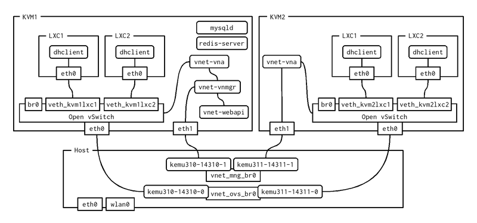

# Run 4 LXC instances on 2 KVM instances

## Network Structure



## Build

Simply, type "make".

```
$ git clone https://github.com/wakameci/wakame-ci-cluster.git
$ cd wakame-ci-cluster/kvm-guests/192.168.3.10-vnetdev/
$ make
$ ps aux|grep qemu-|grep root
root     15480  9.7  4.0 5425116 671340 ?      Sl   19:22   1:14 qemu-system-x86_64 -enable-kvm -name kemu310 -cpu qemu64,+vmx -m 1024 -smp 1 -vnc 127.0.0.1:11310 -k en-us -rtc base=utc -monitor telnet:127.0.0.1:14310,server,nowait -serial telnet:127.0.0.1:15310,server,nowait -drive file=./box-disk1.raw,media=disk,boot=on,index=0,cache=none,if=virtio -netdev tap,ifname=kemu310-14310-0,id=hostnet0,script=,downscript= -device virtio-net-pci,netdev=hostnet0,mac=52:54:00:51:06:47,bus=pci.0,addr=0x3 -netdev tap,ifname=kemu310-14310-1,id=hostnet1,script=,downscript= -device virtio-net-pci,netdev=hostnet1,mac=52:54:00:51:16:47,bus=pci.0,addr=0x4 -pidfile kvm.pid -daemonize
root     25325 13.0  1.4 5604284 236364 ?      Sl   19:33   0:09 qemu-system-x86_64 -enable-kvm -name kemu311 -cpu qemu64,+vmx -m 1024 -smp 1 -vnc 127.0.0.1:11311 -k en-us -rtc base=utc -monitor telnet:127.0.0.1:14311,server,nowait -serial telnet:127.0.0.1:15311,server,nowait -drive file=./box-disk1.raw,media=disk,boot=on,index=0,cache=none,if=virtio -netdev tap,ifname=kemu311-14311-0,id=hostnet0,script=,downscript= -device virtio-net-pci,netdev=hostnet0,mac=52:54:00:51:06:48,bus=pci.0,addr=0x3 -netdev tap,ifname=kemu311-14311-1,id=hostnet1,script=,downscript= -device virtio-net-pci,netdev=hostnet1,mac=52:54:00:51:16:48,bus=pci.0,addr=0x4 -pidfile kvm.pid -daemonize
```

## Usage

Fisrt, run following command on a console.

```
$ telnet localhost 15310
10-vnetdev login: kemukins
Password: kemukins
[kemukins@10-vnetdev ~]$ 0000-runall.sh
localhost login: root
Password: root
[root@localhost ~]# ifup eth0
[root@localhost ~]# ifconfig |grep -A 1 eth0
eth0      Link encap:Ethernet  HWaddr 00:18:51:E5:35:01  
          inet addr:10.0.0.200  Bcast:10.0.0.255  Mask:255.255.255.0

```

Second, run following command on another console.

```
$ telnet localhost 15311
11-vnetdev login: kemukins
Password: kemukins
[kemukins@11-vnetdev ~]$ 0000-runall.sh
localhost login: root
Password: root
[root@localhost ~]# ifup eth0
[root@localhost ~]# ifconfig |grep -A 1 eth0
eth0      Link encap:Ethernet  HWaddr 00:18:51:E5:35:03  
          inet addr:10.0.0.202  Bcast:10.0.0.255  Mask:255.255.255.0
[root@localhost ~]# ping 10.0.0.200
PING 10.0.0.200 (10.0.0.200) 56(84) bytes of data.
64 bytes from 10.0.0.200: icmp_seq=1 ttl=64 time=3.26 ms
64 bytes from 10.0.0.200: icmp_seq=2 ttl=64 time=0.683 ms
64 bytes from 10.0.0.200: icmp_seq=3 ttl=64 time=0.640 ms
```

