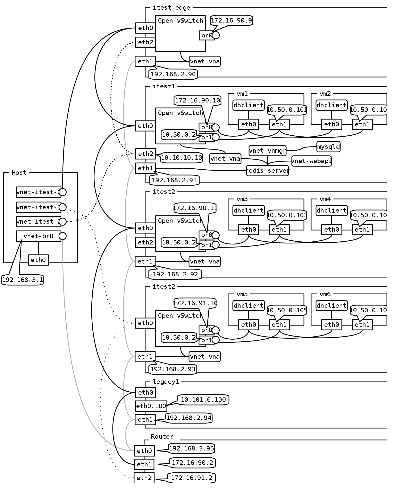

# OpenVNet test environment

## Network Structure



This environment uses nested kvm.

**Terminology**

* The bare metal on which this environment runs is referred to as the `Host`.
* itest-edge, itest1, itest2, itest3, legacy1 and router are referred to as `Layer 1 KVM`
* vm1, vm2, vm3, vm4, vm5 and vm6 are referred to as `Layter 2 KVM` or `nested KVM`

* All networking between machines in *Layer 1 KVM* is referred to as the `physical network`. It might be virtual in reality, but from OpenVNet's point of view it's the physical network. It's the network infrastructure that's *just there* and OpenVNet has no control over. OpenVNet will build virtual networks on top of it.
* All networking between machines in *Layer 2 KVM* is referred to as the `virtual network`. These are the networks that OpenVNet creates and manages.

**Networking related remarks**

* All bridges on the host use the Linux bridge.
* itest-edge, itest1, itest2, and itest3 use Open vSwitch as their bridge.
* itest1 and itest2 are in the same *physical* subnet. OpenVNet will use MAC2MAC between them.
* itest3 is in another *physical* subnet. OpenVNet will use MAC2MAC over GRE tunnels between it and the other machines.
* All the `router` machine does is route packets between the above two subnets.
* The itest-edge and legacy1 machines, represent a non OpenVNet managed physical network being connected to OpenVNet's virtual networks. Legacy1 is the network, itest-edge does the connecting.

## Setup

### Make sure nested KVM is enabled on the host

```
cat /sys/module/kvm_intel/parameters/nested
Y
```

If the following command didn't output **Y**, try this.

```
sudo modprobe -r kvm_intel
sudo modprobe kvm_intel 'options nested=1'
```

If you're not using an intel processor, the commands will be slightly different. Sorry but you're on your own for that one. I'm sure Google can help. ;)
